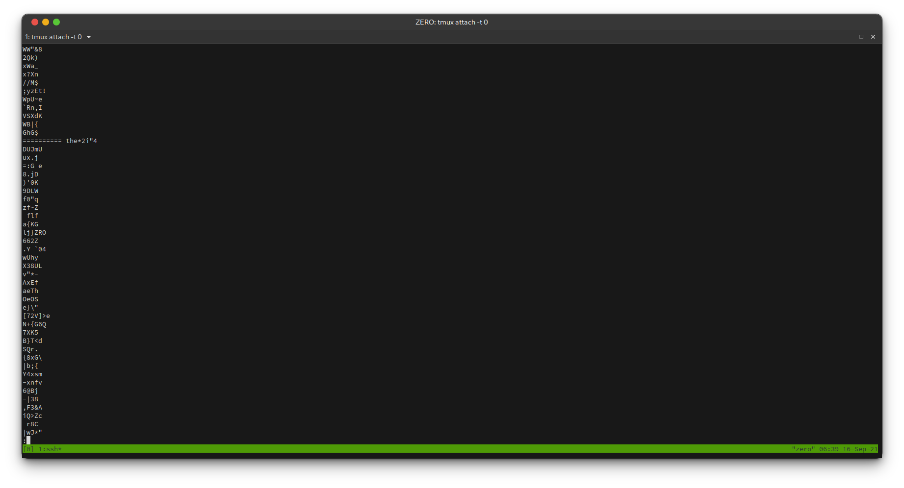

# Level 09

## Level Goal
The password for the next level is stored in the file `data.txt` in one of the
few human-readable strings, preceded by several `=` characters.

## Access
```
ssh bandit9@bandit.labs.overthewire.org -p 2220
```
pwd: UsvVyFSfZZWbi6wgC7dAFyFuR6jQQUhR

## File Type
```
file data.txt

data.txt: data
```

## Search for preceeded by '='
```
strings data.txt

===truKLdjsbJ5g7yyJ2X2R0o3a5HQJFuLk
```




# Flag
```
truKLdjsbJ5g7yyJ2X2R0o3a5HQJFuLk
```

